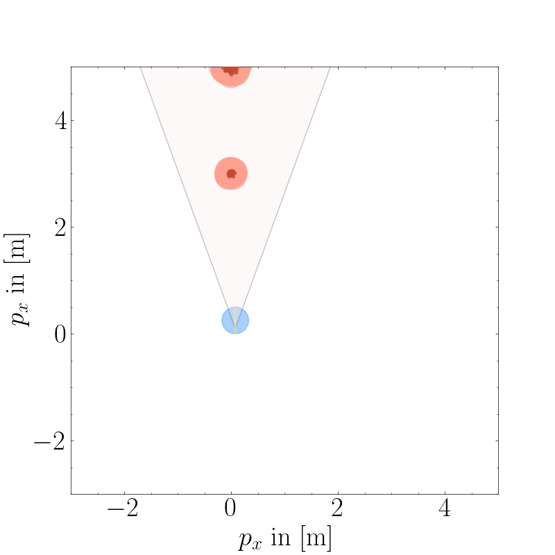
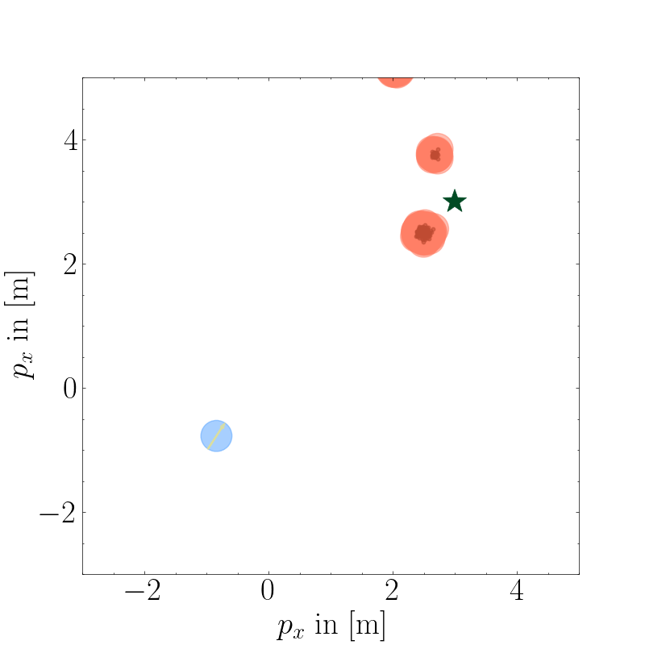

# CBFs for Sample-Based Beliefs

This repository accompanies the paper **"Risk-Aware Robot Control in Dynamic Environments using Belief Control Barrier Functions"**, submitted to CDC 2025.

## Installation

Tested on **Ubuntu 22.04** with **CUDA 12.6**.

Clone the repository:

```zsh
git clone https://github.com/KTH-RPL-Planiacs/sample_based_bcbf
cd sample_based_bcbf
```

Create and activate the virtual environment using [Mamba](https://mamba.readthedocs.io/en/latest/index.html).
```zsh
mamba env create -f environment.yml
mamba activate sample_based_bcbf
```

## Run
To run the main experiment and collect data:
```zsh
python3 main.py 
```
To visualize by animation:

```zsh
zsh scripts/create_gif.sh
```

In both examples (Object Tracking and Collision Avoidance), we have access to the sample-based object beliefs drawn from Gaussian mixtures.
<p float="left">
    
    
</p>